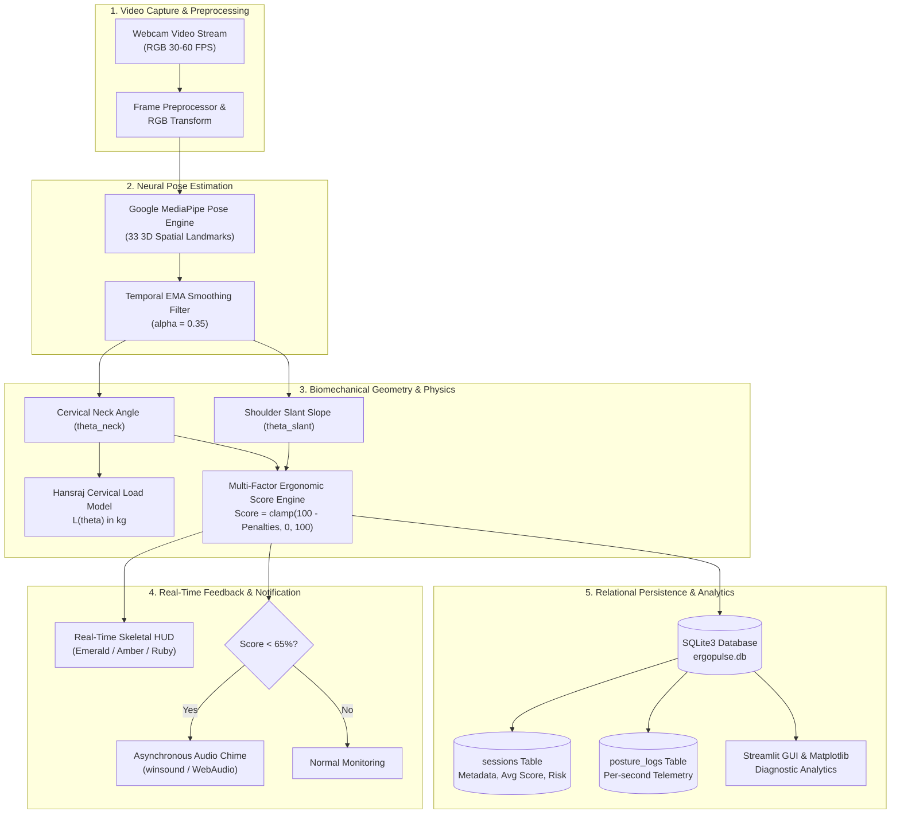
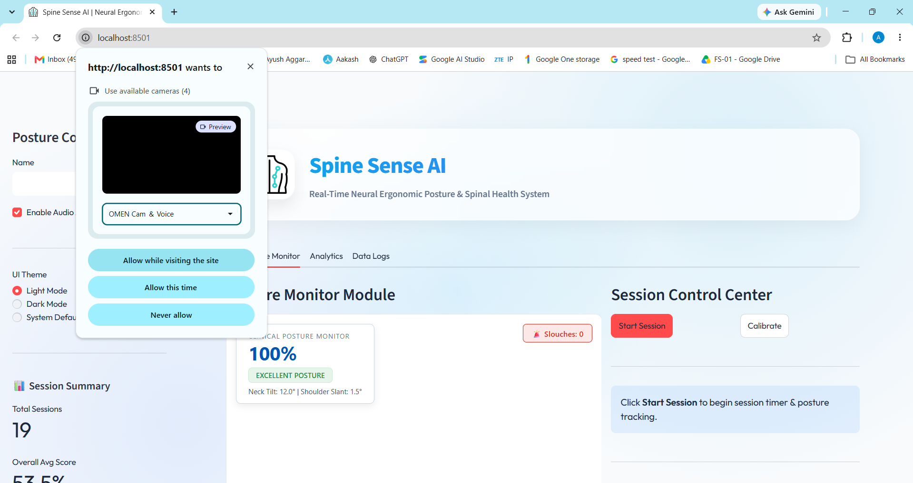
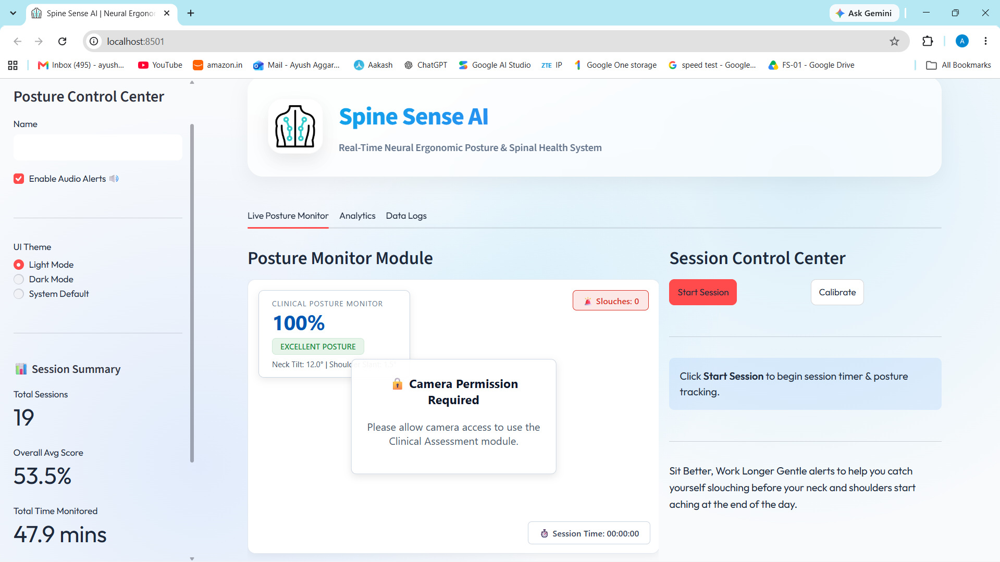
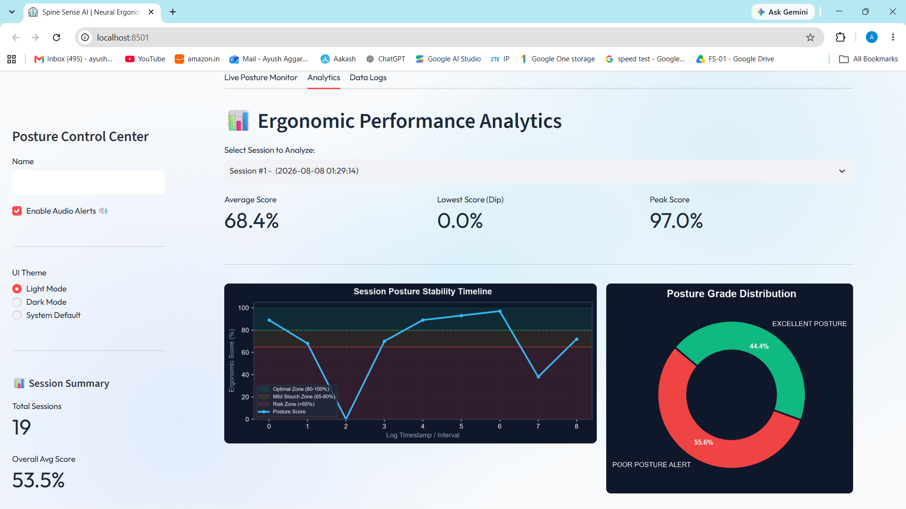
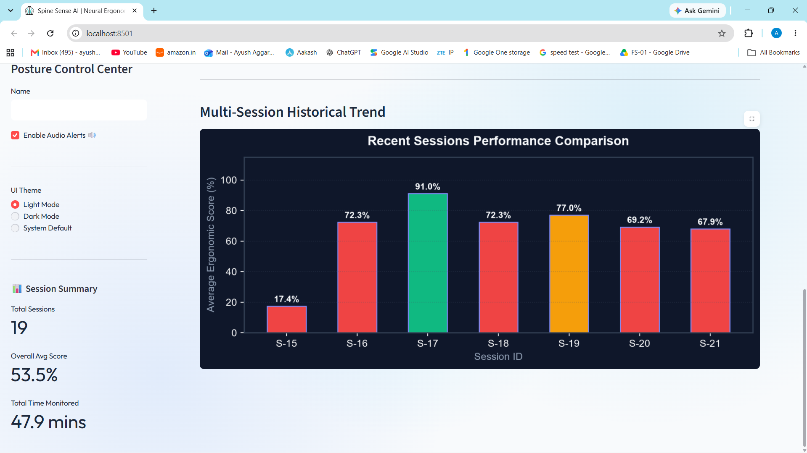
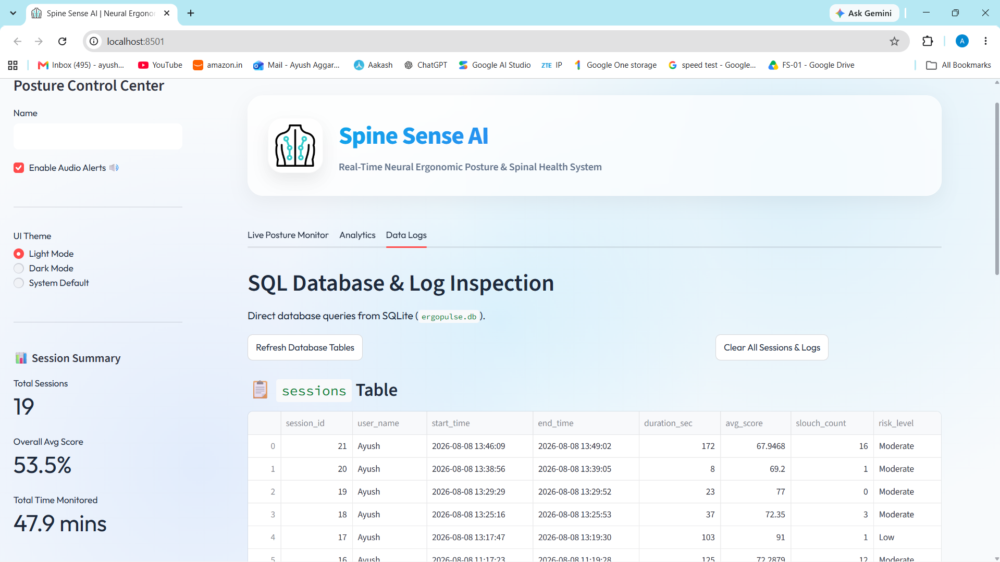

<div align="center">

  

  # 🌟 SpineSense AI (ErgoPulse)
  ### *Next-Generation Real-Time Neural Ergonomic Posture & Spinal Health Companion*

  [](https://www.python.org/)
  [](https://streamlit.io/)
  [](https://developers.google.com/mediapipe)
  [](https://opencv.org/)
  [](https://www.sqlite.org/)
  [](LICENSE)
  [](#getting-started)

  <p align="center">
    <b>Transforming ordinary webcams into medical-grade, non-invasive biomechanical posture analyzers.</b><br>
    Zero wearable sensors • 100% On-Device Edge Privacy • Millisecond Latency • Clinical Hansraj Cervical Load Modeling
  </p>

  <p align="center">
    <a href="#-key-features">Key Features</a> •
    <a href="#-system-architecture">System Architecture</a> •
    <a href="#-biomechanical-mathematics--scoring">Biomechanical Formulation</a> •
    <a href="#-ui-showcase">UI Showcase</a> •
    <a href="#-getting-started">Getting Started</a> •
    <a href="#-database-schema">Database Schema</a> •
    <a href="#-project-structure">Project Structure</a>
  </p>
</div>

---

## 📌 Executive Summary & Problem Statement

Modern desk workers, software engineers, and students spend **6 to 10 hours daily** in front of computer displays. During prolonged sessions, unconscious postural drift occurs:

* **Tech-Neck & Cervical Spine Degeneration:** Every inch the head tilts forward significantly multiplies the gravitational strain on the cervical vertebrae. At a 60° forward inclination, effective head weight surges from **5 kg (11 lbs)** to **27 kg (60 lbs)** (*Dr. Kenneth K. Hansraj Spinal Model*).
* **Reduced Respiratory Efficiency:** Poor slouching compressions reduce vital lung capacity by up to **30%**, inducing chronic fatigue, shallow breathing, and reduced cognitive focus.
* **Lack of Continuous Awareness:** Traditional solutions require bulky wearable sensors or costly specialized chairs. Users remain unaware of poor posture until chronic musculoskeletal pain emerges.

**SpineSense AI (ErgoPulse)** provides an autonomous, real-time AI biomechanics coach. Operating entirely locally on standard camera hardware, it computes 3D skeletal landmarks, tracks cervical and bi-acromial vectors, estimates real-time spinal loads, emits proactive acoustic alerts, and generates clinical session analytics.

---

## 🚀 Key Features

<table>
  <tr>
    <td width="50%">
      <h3>👁️ Neural Pose Landmark Tracking</h3>
      <ul>
        <li>Leverages <b>Google MediaPipe Tasks</b> to extract 33 3D spatial keypoints $(x, y, z)$ in real-time.</li>
        <li>Custom <b>Temporal Exponential Moving Average (EMA)</b> filtering ($\alpha=0.35$) eliminates camera sensor noise and keypoint jitter.</li>
      </ul>
    </td>
    <td width="50%">
      <h3>📐 Biomechanical Vector Analysis</h3>
      <ul>
        <li>Calculates <b>Cervical Neck Inclination Angle</b> relative to true vertical.</li>
        <li>Computes <b>Bi-Acromial Shoulder Slant</b> to instantly flag asymmetrical shoulder dipping and lateral spine curvature.</li>
      </ul>
    </td>
  </tr>
  <tr>
    <td width="50%">
      <h3>🩺 Clinical Hansraj Load Modeling</h3>
      <ul>
        <li>Translates angular neck deflection into real-time <b>Cervical Spine Pressure (kg / lbs)</b>.</li>
        <li>Offers quantitative physical feedback on spinal strain for informed posture correction.</li>
      </ul>
    </td>
    <td width="50%">
      <h3>🚨 Multi-Tier Live Alerts & Scoring</h3>
      <ul>
        <li>Continuous <b>0% to 100% Ergonomic Health Score</b> updated frame-by-frame.</li>
        <li>Dynamic color-coded HUD feedback: 🟢 Optimal ($80\text{--}100\%$), 🟡 Mild Slouch ($65\text{--}80\%$), 🔴 Risk Alert ($<65\%$).</li>
        <li>Non-intrusive asynchronous audio warning system with smart cooldown to prevent alert fatigue.</li>
      </ul>
    </td>
  </tr>
  <tr>
    <td width="50%">
      <h3>📊 Deep Diagnostic Analytics</h3>
      <ul>
        <li>Interactive session stability timelines with zoned threshold banding.</li>
        <li>Posture grade distribution donut breakdown.</li>
        <li>Multi-session longitudinal trend tracking across historical sessions.</li>
        <li>One-click CSV telemetry reports and 7-day hourly rolling average exports.</li>
      </ul>
    </td>
    <td width="50%">
      <h3>🎨 Modern Glassmorphic Dashboard</h3>
      <ul>
        <li>Sleek frosted glass UI with fluid Light Mode and Neon Dark Mode palettes.</li>
        <li>Dual-process launcher (`run.py`) featuring an Apple-inspired animated splash screen.</li>
        <li>Dual execution options: High-efficiency browser client canvas component or full OpenCV engine.</li>
      </ul>
    </td>
  </tr>
</table>

---

## 🏗️ System Architecture

SpineSense AI operates on a modular, decoupled pipeline engineered for high-throughput video processing, millisecond-level telemetry logging, and responsive analytical visualization:



---

## 🧮 Biomechanical Mathematics & Scoring

### 1. Cervical Neck Inclination Angle ($\theta_{\text{neck}}$)
Given the anatomical midpoint between ears $P_{\text{ear}} = \frac{P_{\text{left\_ear}} + P_{\text{right\_ear}}}{2}$ and midpoint between shoulders $P_{\text{shoulder}} = \frac{P_{\text{left\_sh}} + P_{\text{right\_sh}}}{2}$:

$$\Delta x = x_{\text{shoulder}} - x_{\text{ear}}, \quad \Delta y = y_{\text{shoulder}} - y_{\text{ear}}$$

$$\theta_{\text{neck}} = \left| \arctan\left( \frac{|\Delta x|}{|\Delta y|} \right) \times \frac{180^\circ}{\pi} \right|$$

### 2. Bi-Acromial Shoulder Slant Angle ($\theta_{\text{shoulder}}$)
Measures coronal-plane tilt across the left and right acromioclavicular joints:

$$\Delta x_{\text{sh}} = |x_{\text{right\_sh}} - x_{\text{left\_sh}}|, \quad \Delta y_{\text{sh}} = |y_{\text{right\_sh}} - y_{\text{left\_sh}}|$$

$$\theta_{\text{shoulder}} = \arctan\left( \frac{\Delta y_{\text{sh}}}{\Delta x_{\text{sh}} + \epsilon} \right) \times \frac{180^\circ}{\pi}$$

### 3. Hansraj Cervical Load Model ($L$)
Clinical biomechanical quadratic regression modeling effective cervical compression load as head tilt angle $\theta$ increases:

$$L(\theta) = 5.0 + 0.28\theta + 0.0015\theta^2 \quad (\text{for } 0^\circ \le \theta \le 60^\circ)$$

* At $\theta = 0^\circ$ (Neutral Alignment): **$\approx 5.0\text{ kg } (11\text{ lbs})$**
* At $\theta = 30^\circ$ (Moderate Slouch): **$\approx 14.8\text{ kg } (32.6\text{ lbs})$**
* At $\theta = 60^\circ$ (Severe Tech-Neck): **$\approx 27.2\text{ kg } (60.0\text{ lbs})$**

### 4. Dynamic Ergonomic Posture Score ($S$)
Continuous scoring penalized quadratically for deviations past baseline thresholds ($\theta_{\text{neck\_base}} = 12^\circ$, $\theta_{\text{slant\_base}} = 2.5^\circ$):

$$\text{Pen}_{\text{neck}} = \max(0, (\theta_{\text{neck}} - 12.0) \times 2.5)$$

$$\text{Pen}_{\text{slant}} = \max(0, (\theta_{\text{shoulder}} - 2.5) \times 3.8)$$

$$S = \text{clamp}\big(100 - (\text{Pen}_{\text{neck}} + \text{Pen}_{\text{slant}}),\, 0,\, 100\big)$$

---

## 🖼️ UI Showcase

<div align="center">
  <table>
    <tr>
      <td width="50%" align="center">
        <b>1. Live Posture Monitor (Neural HUD)</b><br><br>
        
      </td>
      <td width="50%" align="center">
        <b>2. Session Controls & Live Telemetry</b><br><br>
        
      </td>
    </tr>
    <tr>
      <td width="50%" align="center">
        <b>3. Ergonomic Stability Timeline & Analytics</b><br><br>
        
      </td>
      <td width="50%" align="center">
        <b>4. Historical Multi-Session Trend Tracking</b><br><br>
        
      </td>
    </tr>
    <tr>
      <td colspan="2" align="center">
        <b>5. SQL Relational Database Inspector & Telemetry Export</b><br><br>
        
      </td>
    </tr>
  </table>
</div>

---

## 📂 Project Structure

```
SpineSense AI Main/
├── Database/                         # Database scripts, DDL schemas, and SQL dump files
│   ├── README.md                     # Dedicated Database documentation
│   ├── schema.sql                    # Production schema (DDL), indexes, and analytical views
│   └── spinesense_db.sql             # Complete SQL database dump (DDL + DML)
├── Main Project/                     # Core application codebase
│   ├── .streamlit/                   # Streamlit server & theme configurations
│   ├── assets/                       # Custom components and documentation assets
│   │   ├── camera_component/         # Custom zero-latency web camera component (HTML/JS/CSS)
│   │   │   └── index.html            # Web-based MediaPipe landmarking & telemetry bridge
│   │   └── project_brief.md          # Technical overview & problem brief
│   ├── models/                       # Pretrained neural models
│   │   └── pose_landmarker.task      # MediaPipe Pose Landmarker neural weights (33 points)
│   ├── splash_screen/                # Animated startup launcher
│   │   ├── index.html                # Apple-inspired smooth gradient splash page
│   │   └── logo.png                  # SpineSense high-resolution icon
│   ├── src/                          # Modular Python backend subsystems
│   │   ├── __init__.py               # Python package initialization
│   │   ├── alert.py                  # Thread-safe audio alerting with debounce cooldown
│   │   ├── analytics.py              # Publication-grade Matplotlib diagnostic charts
│   │   ├── database.py               # SQLite database access layer & auto-migration engine
│   │   └── engine.py                 # Core OpenCV + MediaPipe pose biomechanics engine
│   ├── ergopulse.db                  # Local production SQLite database
│   ├── Posture_AG.py                 # Primary Streamlit Dashboard application
│   ├── requirements.txt              # Production Python package dependencies
│   └── run.py                        # Dual-process orchestrator (Splash Screen + Streamlit)
├── UI/                               # High-resolution screenshots and UI artifacts
│   ├── G1.png                        # UI Graphic: Neural Vision Camera HUD
│   ├── G2.png                        # UI Graphic: Session Control Center
│   ├── G3.png                        # UI Graphic: Performance Analytics Charts
│   ├── G4.png                        # UI Graphic: Multi-Session Trends
│   └── G5.png                        # UI Graphic: Database Log Inspector
├── LICENSE                           # Open-source MIT License
└── README.md                         # Project Master Documentation (You are here)
```

---

## 🗄️ Database Schema

The database is built on **SQLite 3** (`ergopulse.db`) with full cross-compatibility for **PostgreSQL** and **MySQL**.

### 1. `sessions` Table
Stores aggregate session metadata, session duration, average scores, and risk classifications:

| Column | Data Type | Constraints | Description |
| :--- | :--- | :--- | :--- |
| `session_id` | `INTEGER` | `PRIMARY KEY AUTOINCREMENT` | Unique session identifier |
| `user_name` | `TEXT` | `NOT NULL` | Username / Student profile identifier |
| `start_time` | `TEXT` | `NOT NULL` | Session start timestamp (`YYYY-MM-DD HH:MM:SS`) |
| `end_time` | `TEXT` | `NULL` | Session end timestamp (`YYYY-MM-DD HH:MM:SS`) |
| `duration_sec` | `INTEGER` | `DEFAULT 0` | Total monitoring time in seconds |
| `avg_score` | `REAL` | `DEFAULT 0.0` | Mean ergonomic score across session ($0.0\text{--}100.0$) |
| `slouch_count` | `INTEGER` | `DEFAULT 0` | Number of poor posture slouch alerts triggered |
| `risk_level` | `TEXT` | `CHECK (risk_level IN ('Low', 'Moderate', 'High', 'Critical'))` | Calculated overall health risk classification |

### 2. `posture_logs` Table
Stores high-frequency granular posture telemetry captured during active sessions:

| Column | Data Type | Constraints | Description |
| :--- | :--- | :--- | :--- |
| `log_id` | `INTEGER` | `PRIMARY KEY AUTOINCREMENT` | Unique telemetry record ID |
| `session_id` | `INTEGER` | `FOREIGN KEY REFERENCES sessions(session_id)` | Parent session reference |
| `timestamp` | `TEXT` | `NOT NULL` | Time of capture (`HH:MM:SS`) |
| `neck_angle` | `REAL` | `NOT NULL` | Measured cervical neck angle deviation in degrees |
| `shoulder_slope` | `REAL` | `NOT NULL` | Measured bi-acromial shoulder slant in degrees |
| `posture_score` | `REAL` | `NOT NULL` | Instantaneous ergonomic score ($0\text{--}100$) |
| `status` | `TEXT` | `DEFAULT 'EXCELLENT POSTURE'` | Classification tag (`EXCELLENT`, `MILD SLOUCH`, `POOR POSTURE`) |

---

## ⚡ Getting Started

### Prerequisites
* **Operating System:** Windows 10/11, macOS, or Linux
* **Python:** `3.10`, `3.11`, `3.12`, `3.13`, or `3.14`
* **Hardware:** Any standard USB or built-in webcam
* **Web Browser:** Google Chrome, Microsoft Edge, Brave, or Firefox

### Installation

1. **Clone the Repository:**
   ```bash
   git clone https://github.com/Ayush-Aggarwal14/SpineSense-AI-Main.git
   cd "SpineSense AI Main"
   ```

2. **Navigate to the Main Project Directory:**
   ```bash
   cd "Main Project"
   ```

3. **(Recommended) Create and Activate a Virtual Environment:**
   ```bash
   # Windows (PowerShell)
   python -m venv venv
   .\venv\Scripts\Activate.ps1

   # macOS / Linux
   python3 -m venv venv
   source venv/bin/activate
   ```

4. **Install Required Dependencies:**
   ```bash
   pip install -r requirements.txt
   ```

---

## 🎮 Running the Application

### Option A: Complete Experience (Splash Screen + Dashboard) — *Recommended*
Launch the dual-process orchestrator. This starts a lightweight HTTP splash screen on port `8000`, spins up the Streamlit engine on port `8501`, and opens your default browser automatically:
```bash
python run.py
```

### Option B: Direct Streamlit Dashboard
Launch directly into the main monitoring interface:
```bash
streamlit run Posture_AG.py
```
Open your browser to `http://localhost:8501`.

---

## 📖 User Workflow Guide

```
[ 1. Calibrate Baseline ] ──> [ 2. Start Session ] ──> [ 3. Real-Time Monitor & Alerts ]
                                                                   │
[ 5. SQL / CSV Export ]   <── [ 4. Inspect Analytics ] <───────────┘
```

1. **Setup & Name Entry:** Enter your name in the sidebar control panel and select your preferred visual theme (**Light Mode**, **Dark Mode**, or **System Default**).
2. **Calibration:** Sit in an upright, ergonomically optimal posture facing the webcam and click **"Calibrate"**.
3. **Session Start:** Click **"Start Session"**. The live session timer activates, and continuous telemetry logging begins.
4. **Active Monitoring & Audio Alerts:** Work naturally. If your neck tilts forward or your shoulders slouch for sustained frames, the HUD turns amber/red and an alert chime prompts you to readjust.
5. **Session Wrap-Up & Analysis:** Click **"End Session"**. Switch to the **Analytics** tab to view your posture timeline, score breakdown, and weekly trend graphs.
6. **Data Export:** Visit the **Data Logs** tab to review the SQL database tables or download detailed CSV reports.

---

## 🛠️ Technology Stack Breakdown

| Layer | Technologies | Role in SpineSense AI |
| :--- | :--- | :--- |
| **Core Runtime** | Python 3.10+ | Core application logic, trigonometry, and data streaming |
| **Computer Vision** | Google MediaPipe Tasks Vision | 33 3D skeletal landmark extraction |
| **Image Processing** | OpenCV (`opencv-python-headless`) | Frame manipulation, HUD overlays, color space conversions |
| **Biomechanical Math** | NumPy, Math | Vector mathematics, Euler angles, EMA landmark smoothing |
| **Data Analytics** | Pandas, Matplotlib | Telemetry aggregation, timeline plotting, statistical reporting |
| **Web Dashboard** | Streamlit | Responsive reactive UI, state management, tab routing |
| **Client Camera HUD** | Vanilla JavaScript, HTML5 Canvas | Zero-latency client-side webcam rendering and landmarking |
| **Database** | SQLite 3 | Relational session storage, auto-migrations, indexing |
| **Design System** | Custom Glassmorphism CSS | Frosted glass styling, Outfit typography, responsive layout |

---

## 🔮 Roadmap & Future Horizons

- [ ] **Dual-Camera 3D Stereoscopy:** Support for front + side camera fusion for true 360° sagittal/coronal spine triangulation.
- [ ] **Ergonomic Break Interventions:** Automated micro-stretch routines and guided cervical spine mobility exercises during slouch detections.
- [ ] **Cloud Sync & Telemedicine Integration:** HIPAA/GDPR-compliant cloud synchronization for physical therapists and orthopedic clinics.
- [ ] **Mobile & Edge Deployment:** Native iOS/Android mobile companion and lightweight Raspberry Pi edge appliance.
- [ ] **Smart Desk & IoT Integration:** Bluetooth integration to automatically raise/lower motorized sit-stand desks when slouching persists.

---

## 👥 Authors & Acknowledgments

* **Ayush Aggarwal** — *Lead Developer & System Architect* — [GitHub Profile](https://github.com/Ayush-Aggarwal14)
* **Biomechanics Reference:** Formulations based on clinical cervical spine pressure studies by *Dr. Kenneth K. Hansraj, Chief of Spine Surgery, New York Spine Surgery & Rehabilitation Medicine*.
* **Neural Vision:** Powered by *Google MediaPipe Pose Landmark Detection Models*.

---

## 📄 License

This project is licensed under the **MIT License** — see the [LICENSE](LICENSE) file for complete details.

<div align="center">
  <sub>Built with ❤️ for healthier spines and ergonomic productivity worldwide.</sub>
</div>
